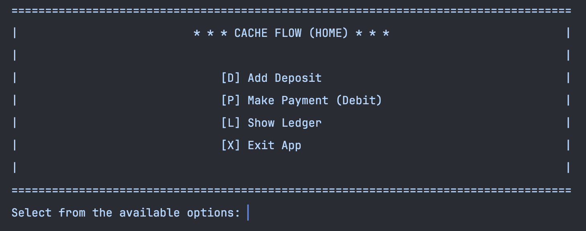

# Accounting Ledger (CashFlow App)

## A terminal application that allows users to add, track, and search transactions to their ledger.



### Features
* Add a new transaction (enter a description, amount, and vendor)
* View your all transactions from ledger or display only certain transactions (deposits/payments)
* Filter through transaction reports by month-to-date, previous month, year-to-date, previous year, or by vendor

### Methods
`Add Transactions`
```declarative
 //Handles adding transaction entries to ledger (Deposits and Payments)
    public static void addTransaction(String userInput) throws IOException {
        //To hold transaction data
        String[] transactionDetails;

        //User selected to Add Deposit
        if (userInput.equals("D") || userInput.equals("d")) {
            //Retrieving transaction input from user and splitting it by vertical bar
            transactionDetails = PrintScreenService.promptUserForTransactionDetails().split("\\|");

            //Passing values from transactionDetails to be written to transactions.csv file
            FileHandlerService.writeToTransactionFile(Double.parseDouble(transactionDetails[0]), transactionDetails[1], transactionDetails[2]);
        }
        //User selected to Make Payment
        else if (userInput.equals("P") || userInput.equals("p")) {
            transactionDetails = PrintScreenService.promptUserForTransactionDetails().split("\\|");

            //Passing values to be written to transactions.csv file, multiplying transactionAmt by -1 to show as negative
            FileHandlerService.writeToTransactionFile(Double.parseDouble(transactionDetails[0]) * -1, transactionDetails[1], transactionDetails[2]);
        }
    }
```

`Show Transactions`
```declarative
  //Prints transactions from ledger
    public static void showTransactionsFromLedger(String userInput) {
        switch (userInput) {
            case "A", "a":
                //User selected to Display All Entries
                for (Transaction t : LedgerApp.ledger) {
                    PrintScreenService.printTransaction(t);
                }
                break;

            case "D", "d":
                //User selected to Show Deposits only (positive transactions)
                for (Transaction t : LedgerApp.ledger) {
                    //If transaction amount is not negative
                    if (t.getAmount() > 0) {
                        PrintScreenService.printTransaction(t);
                    }
                }
                break;

            case "P", "p":
                //User selected to show Payments only (negative transactions)
                for (Transaction t : LedgerApp.ledger) {
                    //If amount is not positive (in the negative range)
                    if (t.getAmount() < 0) {
                        PrintScreenService.printTransaction(t);
                    }
                }
                break;
        }
    }
```

`Vendor Search`
```declarative
public static void searchTransactionByVendor() {
        //Returns user search term
        String searchTerm = PrintScreenService.promptUser("Enter the vendor name you'd like to search from ledger: ");

        if (!searchTerm.isEmpty()) {
            for (Transaction t : LedgerApp.ledger) {
                //Filtering ledger to find all transactions that match vendor name and printing to the console
                if (searchTerm.equalsIgnoreCase(t.getVendor())) {
                   PrintScreenService.printTransaction(t);
                }
            }
        }
    }
```

