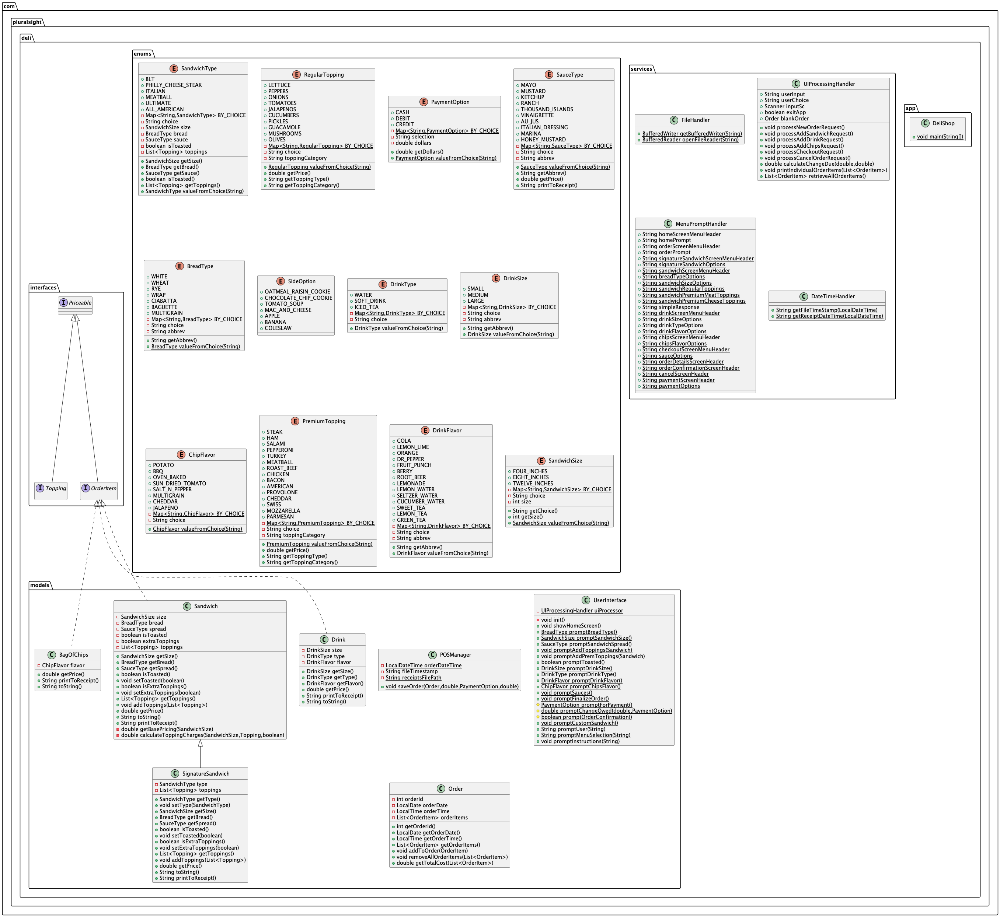

# Deli Shop App (DELI-CIOUS)

## A terminal POS application that allows users to make sandwiches, view their orders, and checkout. 
-Originally intended to be expanded in a revamped web application, later revisions still to come :)


### Features 🎯
* Create your own sandwiches by specifying size, breadType, spread, and meaty toppings
* Print orders to receipt and view them by date/time alongside your order items
* Cancel any order to restart the process of sandwich making

### UML Diagram 😵‍💫


### Methods 
`Add a sandwich`
```declarative
public void processAddSandwichRequest() {
    //Prompt user if they'd like to order from signature sandwiches or create their own sandwich
    System.out.println(MenuPromptHandler.signatureSandwichScreenMenuHeader);

    promptInstructions("Would you like to order from our signature sandwiches?:  ");
    userChoice = promptUser(MenuPromptHandler.simpleResponse);

    if (userChoice.equals("1")) {
        promptCustomSandwich();
    } else {
        System.out.println(MenuPromptHandler.sandwichScreenMenuHeader);

    //Prompting to get sandwich size and type of bread
    BreadType sandwichBread = promptBreadType();
    System.out.println(sandwichBread);
    SandwichSize size = promptSandwichSize();
    System.out.println(size);
    SauceType spread = promptSandwichSpread();
    System.out.println(spread);

    //Instantiating a new sandwich
    Sandwich customerSandwich = new Sandwich(size, sandwichBread, spread);
    boolean finished;

    do {
        //Prompt to add regular toppings to sandwich
        promptAddToppings(customerSandwich);

        //Viewing regular toppings on sandwich
        List<Topping> addedToppings = customerSandwich.getToppings();
        System.out.println(addedToppings);

        //Prompt to add premium toppings to sandwich
        promptAddPremToppings(customerSandwich);

        //Viewing premium toppings on sandwich
        List<Topping> appliedPremToppings = customerSandwich.getToppings();
        System.out.println(appliedPremToppings);

        //Setting sandwich to toasted based on user choice
        boolean sandwichToasted = promptToasted();
        customerSandwich.setToasted(sandwichToasted);

        //Adding customer sandwich item to order
        blankOrder.addToOrder(customerSandwich);

        //Exit loop
        finished = true;
    } while (!finished);
  }
}
```


`Adding toppings`
```declarative
    private void promptAddToppings(Sandwich s) {
        List<Topping> regularToppings = new ArrayList<>();

        do {
            //Prompting user for regular sandwich toppings
            promptInstructions("Enter sandwich toppings:  ");
            System.out.println(MenuPromptHandler.sandwichRegularToppings);
            RegularTopping sandwichVeggies = RegularTopping.valueFromChoice(promptMenuSelection("Toppings: "));
            System.out.println(sandwichVeggies);

            regularToppings.add(sandwichVeggies);

            promptInstructions("Would you like to add more toppings?:  ");
            userChoice = promptUser(MenuPromptHandler.simpleResponse);
        } while (!userChoice.equalsIgnoreCase("2"));

        s.addToppings(regularToppings);
    }
```


`Finalizing an order`
```declarative
private void promptFinalizeOrder() {
    List<OrderItem> items = retrieveAllOrderItems();
    System.out.println(items);

    System.out.println(MenuPromptHandler.orderDetailsScreenHeader);

    //Printing all order items by category
    printIndividualOrderItems(items);

    //Calculating total price of every item on order and printing it out
    double orderTotal = blankOrder.getTotalCost(items);
    String printedTotal = String.format("Order total: $%.2f", orderTotal);
    System.out.println(printedTotal);

    //Confirm with user if order is correct
    boolean confirmation = promptOrderConfirmation();

    if (confirmation) {
        //Prompting user for payment method
        PaymentOption payMethod = promptForPayment();
        System.out.println(payMethod);

        //Getting change due for order payment
        double changeForOrder = promptChangeOwed(orderTotal, payMethod);

        //Save order details
        POSManager.saveOrder(blankOrder, orderTotal, payMethod, changeForOrder);
    } else {
        //Prompt for user if order details was incorrect
        System.out.println(MenuPromptHandler.cancelScreenHeader);
        promptInstructions("Would you like to redo the order?:  ");
        userChoice = promptUser(MenuPromptHandler.simpleResponse);

        //Cancel order if user selected "Yes"
        if (userChoice.equals("1")) processCancelOrderRequest();
    }
}
```


`Viewing order items`
```declarative
private void printIndividualOrderItems(List<OrderItem> items) {
    //Filtering for order items by category and printing them out
    List<OrderItem> sandwichesOnOrder = items.stream().filter(orderItem -> orderItem instanceof Sandwich).toList();
    System.out.println(sandwichesOnOrder);

    List<OrderItem> drinksOnOrder = items.stream().filter(orderItem -> orderItem instanceof Drink).toList();
    System.out.println(drinksOnOrder);

    List<OrderItem> chipsOnOrder = items.stream().filter(orderItem -> orderItem instanceof BagOfChips).toList();
    System.out.println(chipsOnOrder);

    List<OrderItem> saucesOnOrder = items.stream().filter(orderItem -> orderItem instanceof SauceType).toList();
    System.out.println("Extra sauces: " + saucesOnOrder);
}
```

### What I Learned ✍🏼
* Navigating the relationships between interfaces, subclasses, enums, and user input was much more complicated as the project grew in scale. 🔄
  * Slowing down to understand what I wanted to do and asking myself, what is the simplest way to do this? 💭
* Planning out what is most important for each of your classes through the class diagrams. Even better to draw it out on paper! 📝
* Getting comfortable with the debugger during those late night coding sessions 💻

### Interesting code
`Enum Mapping to User Input`


`Save & Print Order to Receipt`


### Author 
Anthony Suarez - https://github.com/asuarezop

