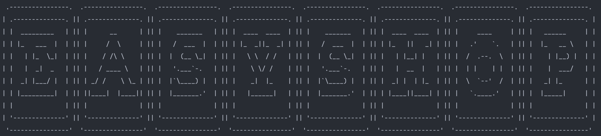
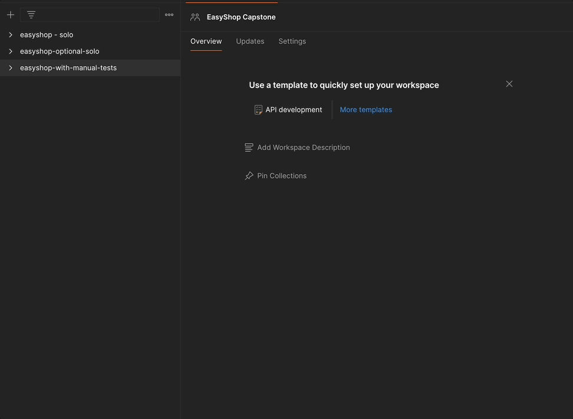
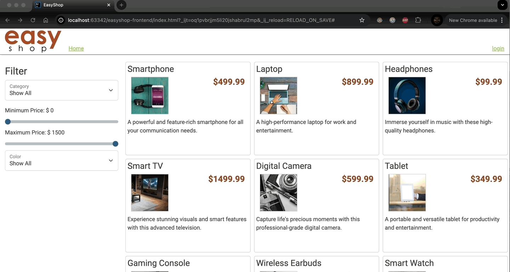
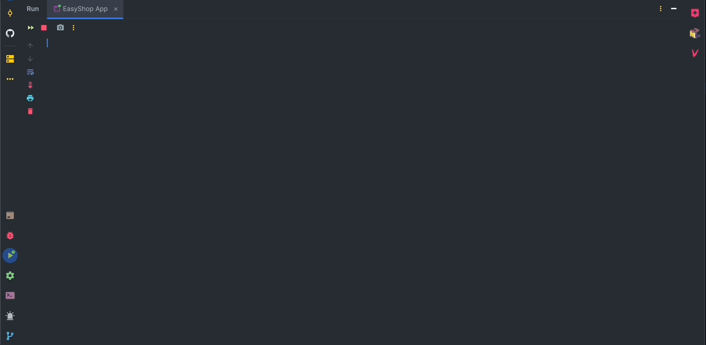

### A client/web server application powered by Spring Boot intended to support e-commerce websites.

## Starting the application

> Note: You will need access to MySQL WorkBench alongside Postman to run integration tests associated 
>       with the application. 

Navigating to the easyshop-capstone directory, you will find three Postman collections to run.
When running these tests, run the entire collection as a whole as opposed to individually.
- This avoids any potential errors being thrown inside of Postman

Demo of running a collection inside Postman:

## Troubleshooting

If there is an issue with a test failing, follow these steps:

1) Reset the database (execute the create_database sql file inside database directory)
2) Rerun the application (this clears any request messages leftover from previous test runs)
3) Rerun the collection (using the same method as above demonstration)

> For debugging purposes, check the message returned in the body of request. 
> You'll get a more detailed explanation behind the error.

## Frontend Page

## Bug Fixes
- Home Screen showed minimum price field duplicated
- Login not working

## Backend Page

## Bug Fixes
- POST request mapping inside ProductController was using incorrect method
- Search functionality not implemented correctly, fixed path for request in Postman
- Duplicate products showing up in the database, added logic to check for existing products by name before inserting a new product with similar properties

## Work Flow

Driven by test implementation and following logical sequence of HTTP request ordering in easyshop collections.
Starting from categories and working my way through the rest of the controller classes to add the missing logic for each request type. 
- GET -> POST -> PUT -> DELETE

For testing, I ran each request individually in Postman first before running it again in the entire collection 
just to make sure the logic was correct. 

> Some slight modifications were made inside the collection variables for each collection to prevent
> overwriting of values when running the next collection.

### Author
Anthony Suarez - https://github.com/asuarezop****

